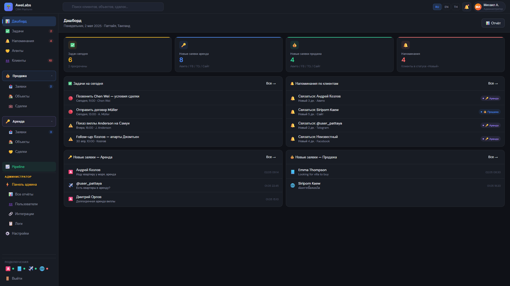
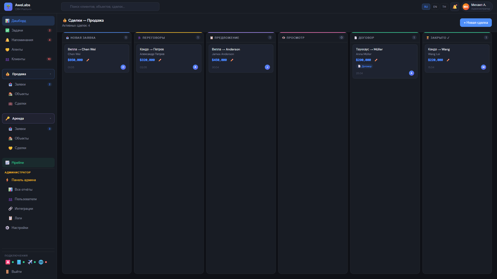
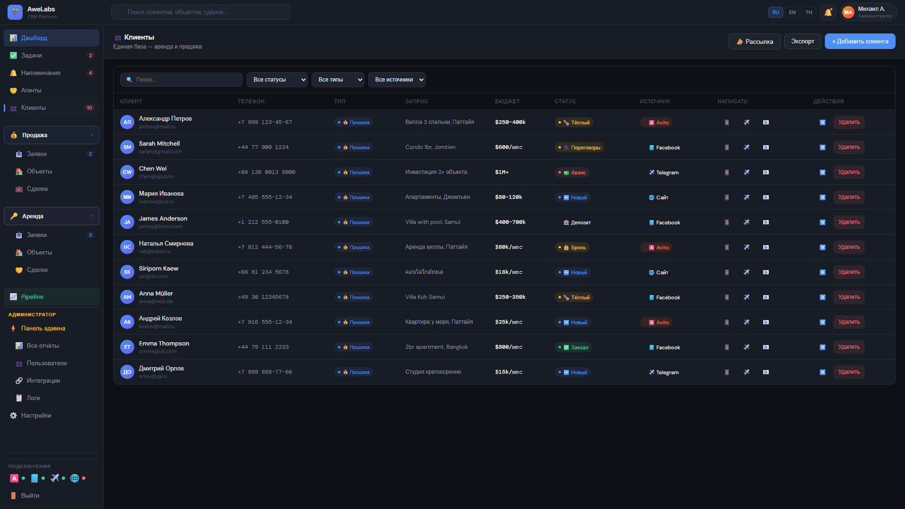
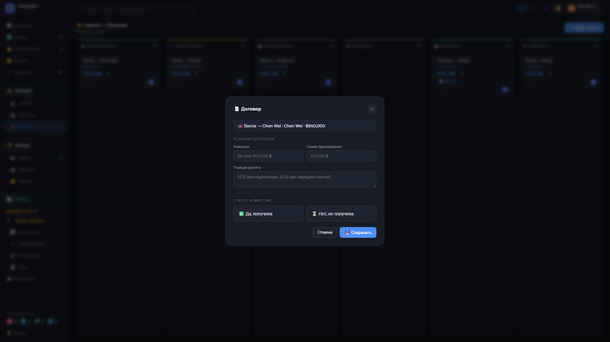

# AweLabs CRM — demo

**[Live demo →](https://mikeabakumoff.github.io/awelabs-crm-demo/)**

A sanitized, front-end-only demo of a CRM built for a real estate agency:
lead intake, client and property registers, a deal pipeline, contracts for both
rent and sale, and an admin area.

> **Disclaimer.** This is a sanitized demo of a production system. All data shown
> is synthetic — names, phone numbers, addresses and amounts were generated for
> the demo. No customer data, credentials or business logic from the production
> deployment is included here. The production backend is not part of this
> repository, and the client is not named.

## Screenshots

| | |
|---|---|
|  |  |
| Dashboard — today's tasks, reminders, incoming leads by channel | Deal pipeline — kanban across six stages |
|  |  |
| Client register — unified rent and sale, with source and status | Contract — commission, deposit, payment schedule |

## What it does

| Area | |
|---|---|
| Leads | separate intake for rent and sale, conversion to client, duplicate detection |
| Clients | unified register plus rent/sale views, cards with history |
| Properties | rent and sale listings |
| Deals | kanban pipeline with drag between stages, lost-deal reasons |
| Contracts | rent and sale contracts, deposits and their return, commission status |
| Move-in / move-out | check-in and check-out with balance calculation |
| Tasks & reminders | assignment and completion |
| Agents | register, duplicate checks |
| Broadcasts | channel selection, preview before sending |
| Admin | users, reports, logs, integrations |
| Roles | the interface changes with the selected role |
| Language | RU / EN / TH switch |

## Stack

Vanilla JavaScript, HTML and CSS in a single self-contained file. No framework,
no build step, no dependencies, no backend — everything runs in the browser,
which is exactly why it can be published as a static page.

That is a demo constraint, not an architectural preference: the production
system it mirrors has a real backend and database.

## Running it

Open the live link, or clone and open `index.html` in a browser. There is
nothing to install.

---

# AweLabs CRM — демо

**[Живая версия →](https://mikeabakumoff.github.io/awelabs-crm-demo/)**

Обезличенное клиентское демо CRM для агентства недвижимости: приём заявок,
реестры клиентов и объектов, воронка сделок, договоры аренды и продажи,
администраторская часть.

> **Дисклеймер.** Это санированное демо боевой системы. Все данные синтетические —
> имена, телефоны, адреса и суммы сгенерированы для демонстрации. Ни клиентских
> данных, ни доступов, ни бизнес-логики продакшена здесь нет. Серверная часть в
> репозиторий не входит, заказчик не назван.

## Что внутри

| Раздел | |
|---|---|
| Заявки | раздельный приём по аренде и продаже, конвертация в клиента, проверка дублей |
| Клиенты | общий реестр и разрезы по аренде/продаже, карточки с историей |
| Объекты | база по аренде и продаже |
| Сделки | канбан-воронка с перетаскиванием, причины отказа |
| Договоры | аренда и продажа, депозиты и их возврат, статус комиссии |
| Заезд/выезд | заселение и выселение с расчётом баланса |
| Задачи и напоминания | назначение и закрытие |
| Агенты | реестр, проверка дублей |
| Рассылки | выбор канала, предпросмотр перед отправкой |
| Админка | пользователи, отчёты, логи, интеграции |
| Роли | интерфейс меняется в зависимости от роли |
| Язык | переключение RU / EN / TH |

## Стек

Чистый JavaScript, HTML и CSS одним самодостаточным файлом. Ни фреймворка, ни
сборки, ни зависимостей, ни бэкенда — всё работает в браузере, поэтому демо и
публикуется статической страницей.

Это ограничение демо, а не архитектурное предпочтение: у боевой системы, которую
оно повторяет, есть и сервер, и база.
